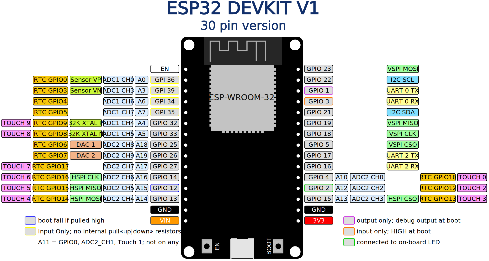

<!-- cSpell:enable -->
<!-- # ESP32 Irrigation automation code -->
# Irrigation Automation

This repository contains a series of arduino sketches created while exploring the use of an ESP32 board to manage plant watering based on windshield washer pumps and capacitive soil moisture sensors. Each sketch, with supporting files, is stored in its own folder, so that the complete folder can be downloaded directly to an Arduino sketchbook folder, then opened with the IDE. The irrigation repo folder can be treated like an Arduino sketchbook. This is a bit different than the usual git repository, in that "versions" are new folders. Previous versions are still visible in their own folders. This is done to make it easy to browse through the progression, and look at intermediate research.

The initial sketches loaded here are around reading the sensors and controlling the pump motor. Other exploration sketches exist, but are not uploaded here yet. For connecting to WiFi, setting the ESP32 RTC from internet time, and sending email notifications. SMS notifications work as well, as long as an email to SMS gate is available. Some telephone service providers have an Internet portal available for that, to send SMS to their own customers phones.

Some code blocks «will» also have examples and additional backround information in the [esduino](https://github.com/mMerlin/esduino) repository.

* [send text](#link_send_text)
* [capacitive soil moisture sensor](#link_sensor)
* [capacitive soil moisture sensor with pump](#link_pump1)
* [mcpwm explore](#link_esp_motor)
* [capacitive soil moisture sensor with pump2](#link_pump2)
* [capacitive soil moisture sensor with pump3](#link_pump3)
* [capacitive soil moisture sensor with pump4](#link_pump4)
* [capacitive soil moisture sensor with pump5](#link_pump5)
* [project pin assignments](https://docs.google.com/spreadsheets/d/15oZebEyCOaAFS-5BlYQ_HMpaug-03ncQI8R5PY9P7Rg/edit#gid=0)
* [pump5](#link_just_pump5)
* [analog test](#link_analog_test)
* [watering](#link_watering)
* [pump6](#link_pump6)
* [pump7](#link_pump7)
* [pump8](#link_pump8)
* [pump9](#link_pump9)
* [analog mapping](#link_analog_mapping)
* [devkit v1 30 pinout](#link_devkit30_pinout)
* [adafruit huzzah32 feather pinout](huzzah32_feather_pinout.svg)

<!--
* [Link](#link_link)
## <a name="link_link">⚓</a> Link
-->

* Features to be implemented, tested, merged
  * water level reservoir sensor
  * wifi provisioning
  * ntp updating (and repeating)
  * sending email/sms notifications
  * «secure access» web site
    * certificate
    * authentication
    * authorization by function
    * configuration
    * status
    * history¦log

## <a name="link_send_text">⚓</a> send text

Exploration of sample code to connect to a local wifi access point, set the time from an NTP server, and send notification reports to email and sms targets. This code is an extension and refactoring of the [mobizt ESP Mail Client](https://github.com/mobizt/ESP-Mail-Client) [send text](https://github.com/mobizt/ESP-Mail-Client/blob/master/examples/Send_Text/Send_Text.ino) example code, combined with code from the [getting data & time from NTP server with esp32](https://lastminuteengineers.com/esp32-ntp-server-date-time-tutorial/) tutorial.

* secrets.h plus template_secrets.h
  * see [esduino](https://github.com/mMerlin/esduino) for information about creating and hiding secrets, template, and .gitignore
* refactored to external .cpp and .h files
* access ntp time server
* send email to multiple targets (including SMS)
* gmail key with 'less secure' setting

## <a name="link_sensor">⚓</a> capacitive soil moisture sensor

Reading values from the capacitive soil moisture sensor. This sketch is for a standard 5V UNO class Arduino board. It is used to test access to the sensor. The sensor calibration values are based on 0 to 1023 analog values, and the code from [Capacitive Soil Moisture Sensor](https://www.sigmaelectronica.net/wp-content/uploads/2018/04/sen0193-humedad-de-suelos.pdf). That is different part than being used in the project (different voltage), but the same connection and features.

## <a name="link_pump1">⚓</a> capacitive soil moisture sensor with pump

PWM speed control of the pump motor, triggered by low moisture levels. This sketch is for a standard 5V UNO class Arduino board. It is used to test the hardware motor control driver (a FET) circuit.

## <a name="link_esp_motor">⚓</a> mcpwm explore

Explore configuration and usage of mcpwm library for motor speed control, without using an H bridge. [Espressif esp idf api mcpwm](https://docs.espressif.com/projects/esp-idf/en/stable/esp32/api-reference/peripherals/mcpwm.html) reference and [brushed dc motor control](https://github.com/espressif/esp-idf/tree/1ca2afd/examples/peripherals/mcpwm/mcpwm_brushed_dc_control) example.

## <a name="link_pump2">⚓</a> capacitive soil moisture sensor with pump2

Change to using an ESP32 DevKit board. This uses 3.3 volts, while the sensor works with 5V.  An op-amp with gain locked to 1 is being used to buffer (condition) the signal, and a voltage divider is added (after the op-amp) to reduce the range to match to what the esp32 DevKit board can handle.

Use information from [Espressif esp idf api adc](https://docs.espressif.com/projects/esp-idf/en/stable/esp32/api-reference/peripherals/adc.html) and [Espressif esp idf api mcpwm](https://docs.espressif.com/projects/esp-idf/en/stable/esp32/api-reference/peripherals/mcpwm.html) references to setup initial analog sensor reading, plus pwm speed control for a pump motor. Initial testing found the adc values to be varying considerably, so multiple readings are used and averaged.

* adc library
* mcpwm library

## <a name="link_pump3">⚓</a> capacitive soil moisture sensor with pump3

Refactor to move detail code to descriptive named functions.

* Same basic code logic as pump2, just structured a bit to move details into functions, keeping the top level flow easier to follow
* More hard-coded literal values moved to global constants
* rename some variables to match conventions

## <a name="link_pump4">⚓</a> capacitive soil moisture sensor with pump4

Convert sensor and control code to a basic state machine that does not use delay. This is preparation for handling multiple sensor and pump pairs.

## <a name="link_pump5">⚓</a> capacitive soil moisture sensor with pump5

Initial handling of multiple sensors and pumps.

* Expanded data structures to handle multiple sensors and water pumps
* Each sensor plus pump pair is handled by a separate state machine
* data structure ideas for using multiple factors to determine timing and amount of water to supply
  * Implementing is well beyond the scope of the current project
* move transition handling code to a callable function that takes a data structure for the specific state machine
* move individual state processing code to separate functions
* add shared resource for pump power
* add minimal logging for pump power resource hogging

## <a name="link_just_pump5">⚓</a> pump5

Implement a shell that will later properly handle time of day and relative time references across system time adjustments from NTP updates, and system time counters wrapping from maximum values to zero.

* implement shell for expanded time handling
* move struct and enum definitions into an include file
* move default state machine data initialization to functions

## <a name="link_analog_test">⚓</a> analog test

[ESP32 AnalogWrite](https://github.com/ERROPiX/ESP32_AnalogWrite) polyfill library encountered while exploring ESP32 example code and tutorials. Reviewing the hardware level functionality of the existing code found no reason that the expanded features of the idf library calls were needed. This sketch verifies that, with the polyfill, standard Arduino IDE code has the capabilities needed.

* [ESP32 AnalogWrite](https://github.com/ERROPiX/ESP32_AnalogWrite) polyfill library
* no IDF / ESP32 specific library references, beyond the polyfill, and what is 'builtin' to the ESP32 boards definitions.
* test `analogRead()` and `analogWrite()` functionality
* `analogReadResolution()` to configure for full 12 bits ADC

ISSUES:

Issues were found with the underlying library code, but the scenarios that trigger problems are not needed for the code in this project.

* [polyfill library](issue_documentation/analogWrite_polyfill.md)
* [analogRead](issue_documentation/analogRead_espressif.md)

## <a name="link_watering">⚓</a> watering

 This sketch starts from [capacitive soil moisture sensor with pump3](#link_pump3), adds the `analogWrite()` pollyfill, then re-implements the hardware level sensing and control logic using 'standard' Arduino IDE functions.

* [ESP32 AnalogWrite](https://github.com/ERROPiX/ESP32_AnalogWrite) polyfill library
* no IDF / ESP32 specific library references, beyond the polyfill, and what is 'builtin' to the ESP32 boards definitions.
* refactor to move control data for a sensor+pump pair into a struct that is passed to functions
  * allow generic code, without a complex set of parameters, to be used for multiple pairs

## <a name="link_pump6">⚓</a> pump6

Incorporate `analogWrite()` pollyfill test code from [watering](#link_watering) into a simplified non state machine version of the irrigation code.

* [ESP32 AnalogWrite](https://github.com/ERROPiX/ESP32_AnalogWrite) polyfill library
* no IDF / ESP32 specific library references, beyond the polyfill, and what is 'builtin' to the ESP32 boards definitions.
* typedefs to add type information for common irrigation specific data usage
* named watering zone struct instance
* array of watering zones, although it contains only a single entry

## <a name="link_pump7">⚓</a> pump7

Re-implement state machine logic on top of the polyfill code.

* `analogWrite()` polyfill
* loop over array of irrigation zone state machines
* refactor data structures
* move structure and enum definitions into include file
* expand state machine states
* extended state debug reporting
* expand doxygen function documentation
* shell for smart time handling

## <a name="link_pump8">⚓</a> pump8

refactor time, hardware watering access, most irrigation state machine code to separate .cpp and .h files.

* shell smart time handling in smart_time.cpp and .h
* hardware accessing watering related code moved to watering_management.cpp and .h
* irrigation state transition code moved to irrigation_state.cpp and .h
* implement state transition logging shell

## <a name="link_pump9">⚓</a> pump9

Adjust state transition processing logic to remove unneeded transient states. Simplify the state machine.

* remove most transient states
* refactor to more generic 'resource' wait, instead of power wait.
* implement emergency shutdown. use when code detects inconsistent state.

## <a name="link_analog_mapping">⚓</a> analog mapping

Figure out which GPIO (digital) pin numbers are associated with each of the analog (A«n») pins used for the standard Arduino analogRead() function. The sketch maps analog A«n» references to the normal GPIO pin numbers. This mapping is based on the Arduino 'board' definition file being used. It is considerably different for the various DevKit flavours and the Adafruit HUZZAH32 Feature board.

* DevKit
  * 36=A0 39=A3 32=A4 33=A5 34=A6 35=A7 4=A10 0=A11 2=A12 15=A13 13=A14 12=A15 14=A16 27=A17 25=A18 26=A19
  * The sketch shows that A11 maps to GPIO0, which is not available on the DevKit board pins. The data sheet shows that GPIO0 is also ADC2_CH1, RTC_GPIO11, TOUCH1, EMACK_TX_CLI, CLK_OUT1.
* HUZZAH32
  * 26=A0 25=A1 34=A2 39=A3 36=A4 4=A5 14=A6 32=A7 15=A8 33=A9 27=A10 12=A11 13=A12 35=A13

## <a name="link_devkit30_pinout">⚓</a> devkit v1 30 pinout

* [ESP32 Pin description «functions»](#link_esp32_pins)

Create an extended svg version of pinout diagrams found for the 30 pin ESP32 DevKit V1 board. That is often (incorrectly) labeled as the 30 GPIO version. It is really 25 GPIO plus power, ground, and enable pins.

<!-- Adafruit ESP32 Feather (esp32)
26=A0
25=A1
34=A2
39=A3
36=A4
4=A5
14=A6
32=A7
15=A8
33=A9
27=A10
12=A11
13=A12
35=A13 -->

<!--
 can not set a good image width using standard markdown, so use html instead

 -->

For extended information, see "2 Pin Definitions" in the [ESP-WROOM-32 datasheet](https://www.espressif.com/sites/default/files/documentation/esp32-wroom-32_datasheet_en.pdf). That is the esp32 module used with the DevKit and HUZZAH32 Feather boards.

More information resources.

* [ESP32 Series datasheet](https://www.espressif.com/sites/default/files/documentation/esp32_datasheet_en.pdf)
  * A.1. Notes on ESP32 Pin Lists includes (11) for Ethernet_MAC. No information seen about using it, but gives a bit of description.
* [ESP32 Technical Reference Manual](https://www.espressif.com/sites/default/files/documentation/esp32_technical_reference_manual_en.pdf)
  * 10 Ethernet Media Access Controller (MAC)
* [ESP32 Resources](https://www.espressif.com/en/products/socs/esp32/resources) links to all available ESP32 documents, SDK and tools
  * Actually, seems to be document titles, not links. Need to do web search to find the documents themselves.

### <a name="link_esp32_pins">⚓</a> ESP32 Pin description «functions»

* [ESP32 Series datasheet](https://www.espressif.com/sites/default/files/documentation/esp32_datasheet_en.pdf)
  * 2.2 Pin Description
  * A.4. IO_MUX ¦ pin to function multiplexing

#### All of the data (I/O) related ESP32 module pins
<!-- cSpell:disable -->
main GPIO | ADC Chn | RTC GPIO | Touch | name | UART | EMAC | more
---|---|---|---|---|---|---|---
0 | 2.1 | 11 | 1 | GPIO0 | | TX_CLK | CLK_OUT1
1 | | | | U0TXT | U0.TXD | RXD2 | CLK_OUT3
2 | 2.2 | 12 | 2 | | | | HSPIWP, HS2_DATA0, SD_DATA0
3 | | | | U0RXD | U0.RXD | | CLK_OUT2
4 | 2.0 | 10 | 0 | GPIO4 | | TX_ER | HSPIHD, HS2_DATA1, SD_DATA1
5 | | | | GPIO5 | | RX_CLK | HS1_DATA6, VSPICSO
6 | | | | SD_CLK | U1.CTS | | HS1_CLK, SD_CLK, SPICLK
7 | | | | SD_DATA_0 | U2.RTS | | HS1_DATA0, SD_DATA0, SPIQ
8 | | | | SD_DATA_1 | U2.CTS | | HS1_DATA1, SD_DATA1, SPID
9 | | | | SD_DATA_2 | U1.RXD | | HS1_DATA2, SD_DATA2, SPIHD
10 | | | | SD_DATA_3 | U1.TXD | | HS1_DATA3, SD_DATA3, SPIWP
11 | | | | SD_CMD | U1.RTS | | HS1_CMD, SD_CMD, SPICSO
12 | 2.5 | 15 | 5 | MTDI | | TXD3 | HSPIQ, HS2_DATA2, SD_DATA2, MTDI
13 | 2.4 | 14 | 4 | MTCK | | RX_ER | HSPID, HS2_DATA3, SD_DATA3, MTCK
14 | 2.6 | 16 | 6 | MTMS | | TXD2 | HSPICLK, HS2_CLK, SD_CLK, MTMS
15 | 2.3 | 13 | 3 | MTDO | | RXD3 | HPSICSO, HS2_CMD, SD_CMD, MTDO
16 | | | | GPIO16 | U2.RXD | CLK_OUT | HS1_DATA4
17 | | | | GPIO17 | U2.TXD | CLK_OUT_180 | HS1_DATA5
18 | | | | GPIO18 | | | HS1_DATA7, VSPICLK
19 | | | | GPIO19 | U0.CTS | TXD0 | VSPIQ
| | | | | | |
21 | | | | GPIO21 | | TX_EN | VSPIHD
22 | | | | GPIO22 | U0.RTS | TXD1 | VSPIWP
23 | | | | GPIO23 | | | HS1_STROBE, VSPID
| | | | | | |
25 | 2.8 | 6 | | GPIO25 | | RXD0 | DAC_1
26 | 2.9 | 7 | | GPIO26 | | RXD1 | DAC_2
27 | 2.7 | 17 | 7 | GPIO27 | | RX_DV |
| | | | | | |
32 | 1.4 | 9 | 9 | 32K_XP | | | 32.768 kHz crystal oscillator input
33 | 1.5 | 8 | 8 | 32K_XN | | | 32.768 kHz crystal oscillator output
34 | 1.6 | 4 | | VDET_1 | | | input only
35 | 1.7 | 5 | | VDET_2 | | | input only
36 | 1.0 | 0 | | SENSOR_VP | | | input only
37 | 1.1 | 1 | | SENSOR_CAPP | | | input only
38 | 1.2 | 2 | | SENSOR_CAPN | | | input only
39 | 1.3 | 3 | | SENSOR_VN | | | input only
<!-- cSpell:enable -->

<!-- cSpell:disable -->
<!-- cSpell:enable -->
<!--
# cSpell:disable
# cSpell:enable
cSpell:words devkit
cSpell:ignore
cSpell:enableCompoundWords
-->
